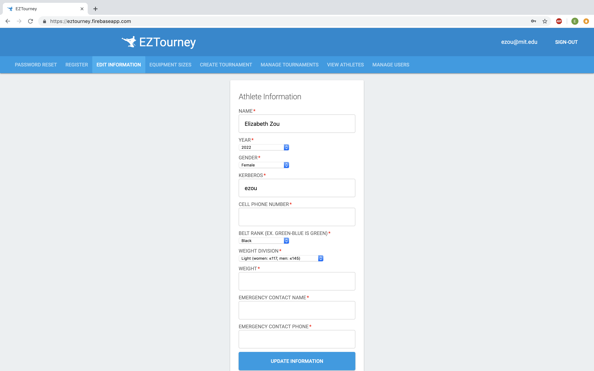
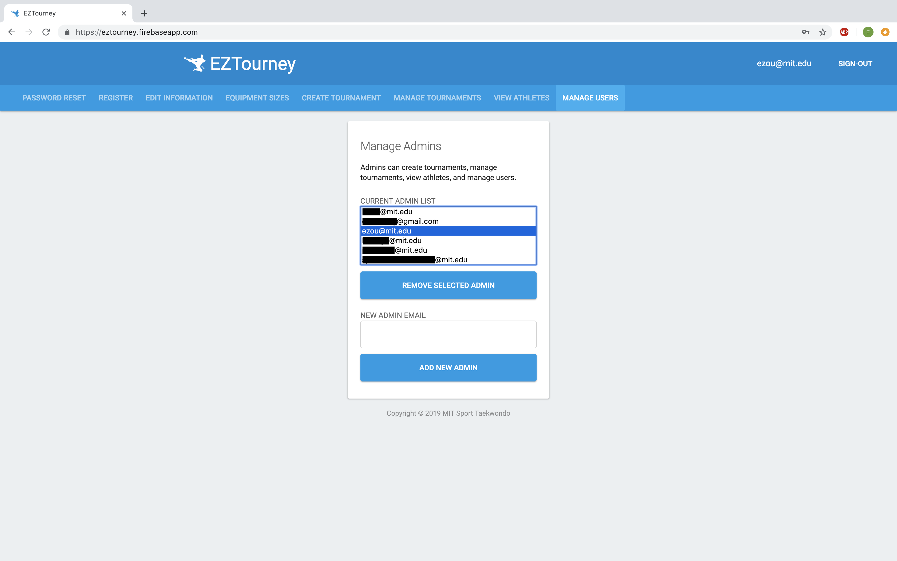

# EZTourney

Web app for MIT Sport Taekwondo to ease the process of tournament registration for tournament coordinators. Athletes register using their MIT email address, admins with their authorized email addresses.

## Software Description

The web app is located [here](https://eztourney.firebaseapp.com/). When a user registers, they will be directed to verify their email. Afterwards, athletes will see a list of athlete pages, admins will see a list of admin pages, and an admin who is also an athlete will see both. Below are lists of all the pages and select screenshots.

### Landing pages

* Login/Register
* Reset password

### Athlete pages

* Reset password
* Register for open tournaments
* Edit personal information

* Edit equipment sizes

### Admin pages

* Reset password
* Create tournament
* Manage tournaments
* View athletes
* Manage users


## Getting Started

These instructions will help any MIT athlete or authorized admin gain access to the system. In general, refresh the page to see any changes, and please refresh after any changes to make sure they are saved.

### Athletes

1. Go to https://eztourney.firebaseapp.com/.
2. Register into the system by typing in your MIT email and a password and click "Register".
3. Send the verification email.
4. Go to your inbox and find the verification email. If nothing shows up, check your spam and try searching for "EZTourney."
5. Now "Sign In" into your EZTourney account!
6. Go to the "Edit Information" tab at the top of the window and fill out all relevant information.
7. Go to the "Equipment Sizes" tab and fill out all relevant information.
8. If a tournament is open for registration, sign up for it on the "Register" tab!

### Admins

Note that you must use an email authorized by an existing admin to access the system.

1. Go to https://eztourney.firebaseapp.com/.
2. Register into the system by typing in your authorized email and a password and click "Register".
3. Send the verification email.
4. Go to your inbox and find the verification email. If nothing shows up, check your spam and try searching for "EZTourney."
5. Now "Sign In" into your EZTourney account!
6. You can make a custom form for tournament registration on the "Create Tournament" tab. Created tournaments are automatically open for registration, and you may not have two tournaments open for registration concurrently.
7. You can manage tournaments on the "Manage Tournaments" tab. This includes closing a tournament from registration, viewing registered athletes and their information, and viewing the equipment sizes of people that need/can be equipment buddy.
8. You can view the information of all athletes in the system on the "View Athletes" tab, including their emergency contact information and equipment sizes.
9. You can add or remove admin emails on the "Manage Users" tab.

## Built With

* [Firebase](https://firebase.google.com/) - Mobile and web application development platform

## Developer Notes

To launch a local server, run `firebase serve --only hosting`.
To deploy, run `firebase deploy`.

If there is the error message `Error: Failed to get Firebase project eztourney. Please make sure the project exists and your account has permission to access it.`, run the following:
```
firebase logout
firebase login
firebase deploy
```
